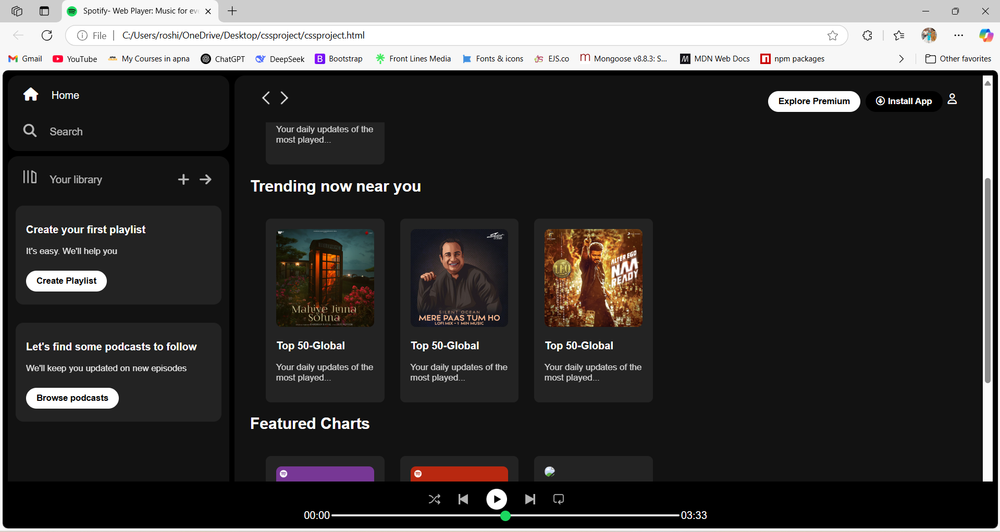

# 🎵 Spotify Web UI Clone  

## 📌 Description  
Spotify Web UI Clone is a front-end project that replicates the user interface of Spotify's web player. It features a dark-themed responsive design with a structured layout, including a sidebar, main content area, and a functional music player. This project focuses on enhancing CSS skills while implementing HTML for structuring and JavaScript for interactive elements.  

## 🛠️ Technologies Used  
- **Frontend**: HTML, CSS, JavaScript  
- **Styling**: CSS Flexbox & Grid, Bootstrap  
- **Icons & Fonts**: Font Awesome, Google Fonts  

## 🚀 Features  
- 🎨 **Responsive UI** – Adaptable to different screen sizes for a seamless experience.  
- 📂 **Sidebar Navigation** – Includes Home, Search, and Library sections.  
- 🎶 **Playlist Management UI** – Users can view trending playlists and explore music categories.  
- ▶️ **Music Player Interface** – Includes play, pause, seek bar, volume control, and song progress tracking.  
- 🌙 **Dark Theme Design** – Styled to match the modern aesthetics of Spotify.  

## 📷 Screenshot  
  

